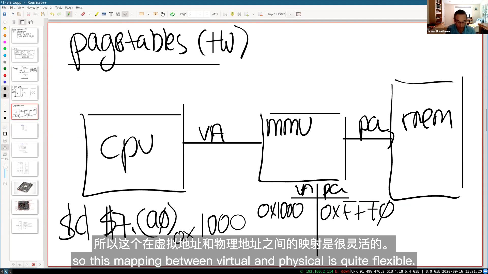
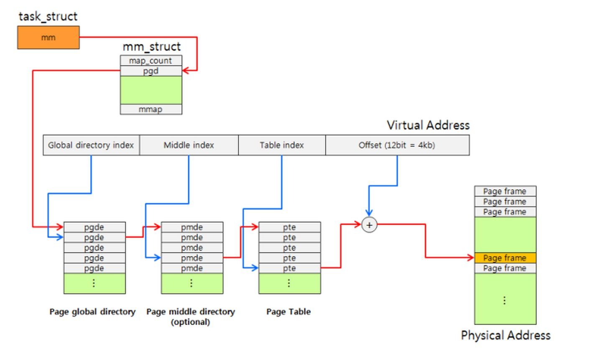
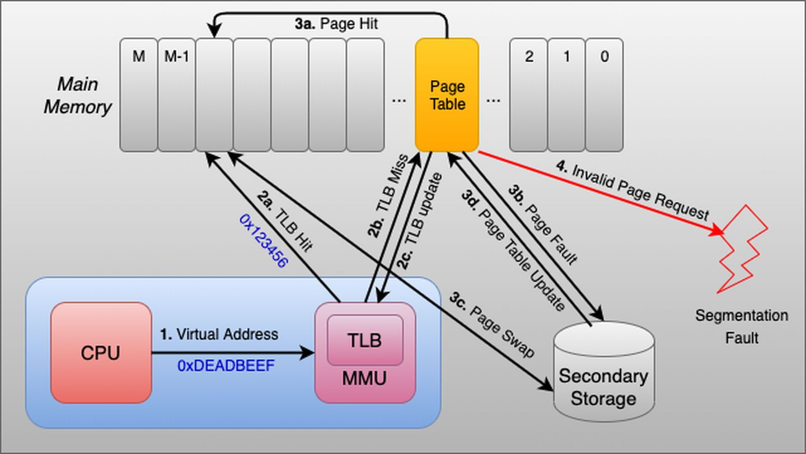

# page tables (VM)

# memory isolation
## adress space

# MMU (memory management unit)
MMU是CPU的一部分，每个处理器core都有一个MMU，包含：
* TLB：是页表的高速缓存，存储着最近转化的一些目录项
  * translation look-side bugger (TLB)
  * cacher of pte entries (va, pa)
* Table Walk Unit：负责从页表中读取虚拟地址对应的物理地址

# RRIC V calling convention and stack frame
c -> asm(.s files) -> binary(object/.o files)
* risc V: reduced ISA
* x86: perseonal compiler(intel, amp), cisc(complex isa)
* isa: instruction set arch
* stack: high -> low adress(sp: bottom of stasck)
  * stack frame(generated by func calls): return adress, prev frame(fp), saved register, local variable
* function prologue & epilogue

# 页表在哪里？
一般来说，任何进程切换都会暗示着更换活动页表集。Linux内核为每一个进程维护一个task_struct结构体（即进程描述符PCB），task_struct->mm_struct结构体成员用来保存该进程的页表。在进程切换的过程中，内核把新的页表的地址写入CR3控制寄存器。

PTE, page table entry

# 虚拟地址怎么转化为物理地址？
对于每次转换，MMU首先在TLB中检查现有的缓存。如果没有命中，根据CR3寄存器，Table Walk Unit将从内存中的页表查询。

# 虚拟内存主要有三个作用
作为缓存工具，提高内存利用率：使用 DRAM 当做部分的虚拟地址空间的缓存（虚拟内存就是存储在磁盘上的 N 个连续字节的数组，数组的部分内容会缓存在 DRAM 中）。扩大了内存空间，当发生缺页异常时，将会把内存和磁盘中的数据进行置换。

作为内存管理工具，简化内存管理：每个进程都有统一的线性地址空间（但实际上在物理内存中可能是间隔、支离破碎的），在内存分配中没有太多限制，每个虚拟页都可以被映射到任何的物理页上。这样也带来一个好处，如果两个进程间有共享的数据，那么直接指向同一个物理页即可。

作为内存保护工具，隔离地址空间：进程之间不会相互影响；用户程序不能访问内核信息和代码。页表中的每个条目的高位部分是表示权限的位，MMU 可以通过检查这些位来进行权限控制（读、写、执行）。

# 参考
[1 操作系统中的多级页表到底是为了解决什么问题？](https://www.zhihu.com/question/63375062)
[2 高频面试题——你真的搞懂物理内存与虚拟内存了吗](https://cloud.tencent.com/developer/news/682507)
